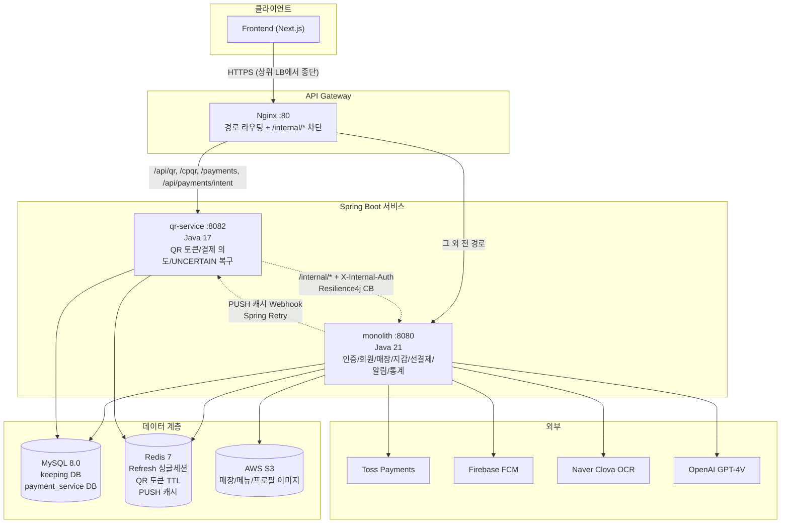
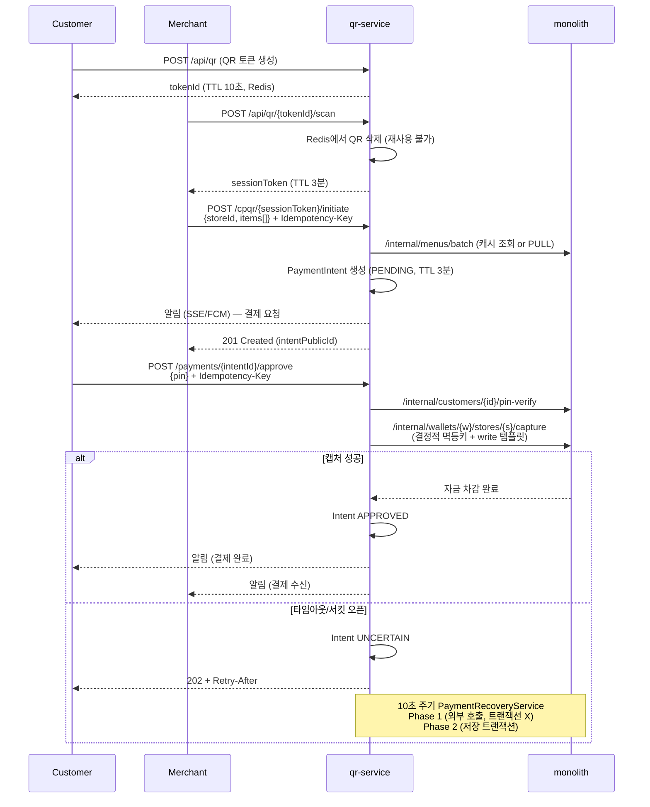
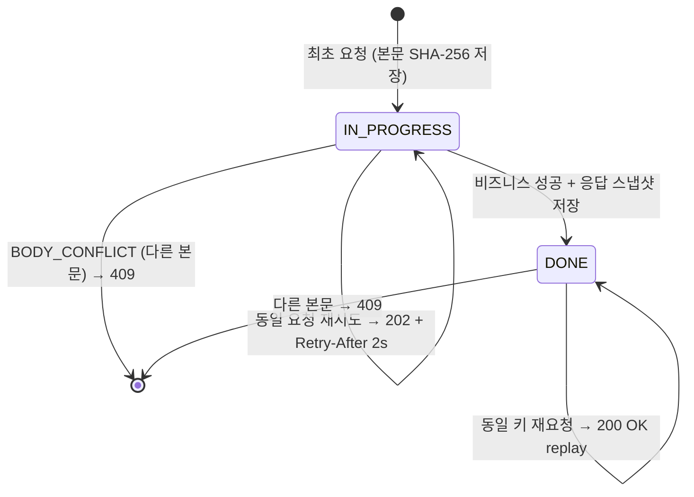
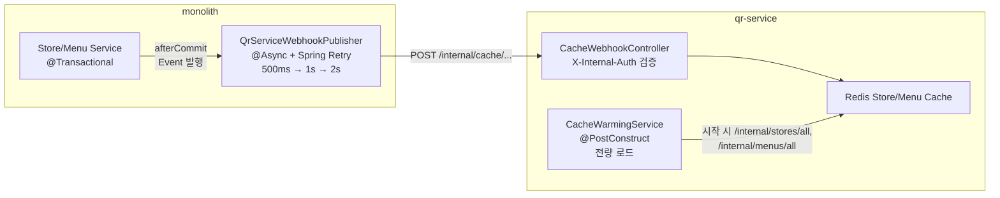
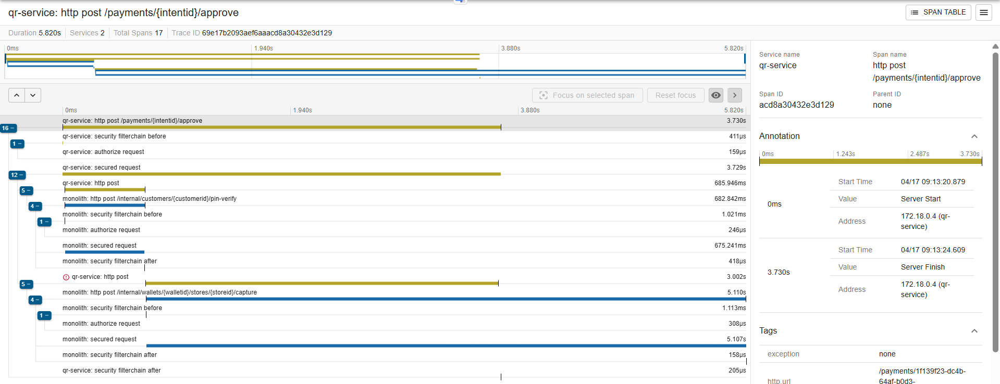
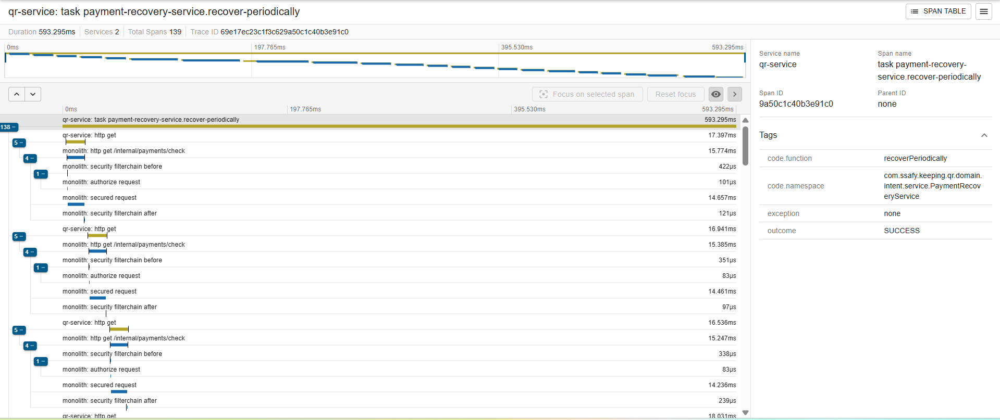
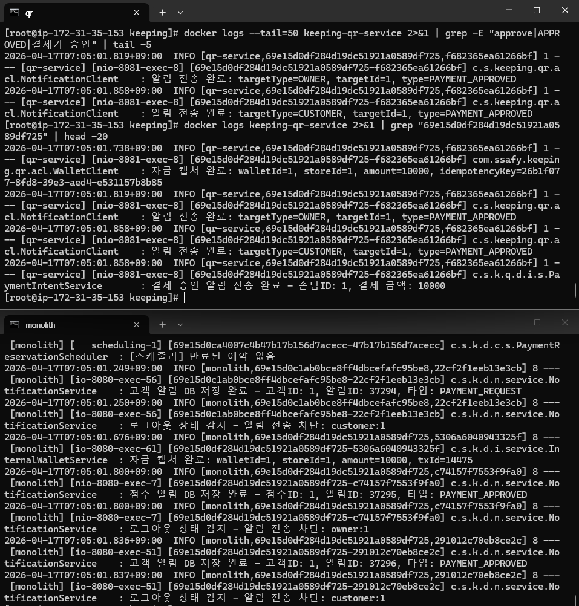

<div align="center">

# Keeping

### 선결제 포인트 기반 QR 결제 플랫폼


</div>

---

## 목차

1. [프로젝트 소개](#1-프로젝트-소개)
2. [아키텍처](#2-아키텍처)
3. [전체 기능 목록](#3-전체-기능-목록)
4. [핵심 기능 상세](#4-핵심-기능-상세)
5. [기술적 의사결정](#5-기술적-의사결정)
6. [프로젝트 문서](#6-프로젝트-문서)
7. [성능 검증 및 관측](#7-성능-검증-및-관측)

---

## 1. 프로젝트 소개

**Keeping**은 고객이 매장에 포인트를 미리 선결제하고, 이를 개인/모임 지갑에서 관리한 뒤 매장에서 QR로 결제하는 소상공인용 포인트 플랫폼입니다.

원래 모놀리식으로 출발한 서비스에서 결제 핵심 경로(QR 토큰 발급 + 결제 의도 승인)를 **독립 Spring Boot 서비스(qr-service)** 로 분리했고, **Nginx API Gateway**가 경로 기반으로 두 서비스에 라우팅합니다. 결제 안정성(멱등성·비관락·자동 복구)과 서비스 간 느슨한 결합(ACL·캐시 webhook·서킷 브레이커)에 집중한 MSA 구조입니다.

### 기술 스택

| 분류 | 기술 |
|------|------|
| **Framework** | Spring Boot 3.5.5, Spring Cloud 2024.0.0, Spring Security, Spring Data JPA, Spring Data Redis |
| **Language / Runtime** | Java 21 (monolith), Java 17 (qr-service) — Docker 런타임은 `eclipse-temurin:21-jre` 통일 |
| **Database** | MySQL 8.0 (논리 DB 2개: `keeping` / `payment_service`), H2 (테스트), Testcontainers |
| **Cache / Session** | Redis 7 (JWT Refresh 싱글세션, QR 토큰 TTL, PUSH 캐시) |
| **Auth** | OAuth2 Kakao + JWT HS256 (jjwt 0.12.5/0.12.3) — Access 15분 / Refresh 14일 |
| **Gateway** | Nginx (경로 기반 라우팅, `/internal/*` 외부 차단) |
| **외부 연동** | Toss Payments, Firebase Admin (FCM), AWS S3, Clova OCR, OpenAI GPT-4V |
| **회복탄력성** | Resilience4j 2.2.0 (Circuit Breaker + Retry, 3종 정책), Spring Retry |
| **관측** | Micrometer + Prometheus + Brave Tracing, Zipkin reporter |
| **계약 테스트** | Spring Cloud Contract 4.1.4 (producer=monolith, consumer=qr-service) |
| **API 문서** | Springdoc OpenAPI 2.7.0 / 2.3.0 (Swagger UI) |
| **Build** | Gradle (두 서비스 각각 독립 프로젝트) |

---

## 2. 아키텍처

### 2-1. 시스템 구성도



### 2-2. 도메인 모듈 구조

```
backend/
├── monolith/src/main/java/com/ssafy/keeping/            Java 21, 포트 8080
│   ├── domain/
│   │   ├── auth/          OAuth2 Kakao, JWT, Refresh Rotation, PIN 인증, 회원가입 티켓
│   │   ├── charge/        선결제 예약→승인 (토스), 충전 보너스, 취소
│   │   ├── event/         결제/취소 이벤트 POJO (발행 미연동 예약 자리)
│   │   ├── favorite/      매장 찜 (소프트 딜리트)
│   │   ├── group/         모임 생성/가입/해체 + 모임장 권한 + 정산
│   │   ├── idempotency/   멱등성 키 관리 (결제·환불·포인트 공용)
│   │   ├── internal/      /internal/* — qr-service ↔ monolith 전용 API + Webhook
│   │   ├── menu/          매장 메뉴 CRUD (S3 이미지, 소프트 딜리트)
│   │   ├── menucategory/  2단계 카테고리 트리
│   │   ├── notification/  SSE + FCM + DB 3단계 전달 전략
│   │   ├── ocr/           사업자등록증(Clova) / 메뉴판(GPT-4V)
│   │   ├── payment/       결제 게이트웨이 추상화(Toss), 거래 원장, 환불
│   │   ├── store/         매장 CRUD, 상태 머신, 점주 통계
│   │   ├── user/          Customer / Owner 분리
│   │   └── wallet/        개인/모임 지갑, 매장별 잔액·Lot(FIFO), 포인트 공유/회수
│   └── global/            ApiResponse, ErrorCode, canonicalObjectMapper, S3, Firebase
│
├── qr-service/src/main/java/com/ssafy/keeping/qr/       Java 17, 포트 8082
│   ├── acl/               Store/Menu ACL + 캐시 (NONE/PULL/PUSH 3-mode)
│   ├── common/            exception, response
│   ├── config/            Security, RestTemplate(read/write/recovery), Cache, JWT
│   ├── domain/
│   │   ├── idempotency/   monolith와 동일 철학 독립 구현
│   │   ├── intent/        PaymentIntent 상태머신 + 2-phase 복구 스케줄러
│   │   └── qr/            QR 토큰/세션 (Redis @RedisHash)
│   ├── loadtest/          IndexBenchmarkController
│   └── security/          JwtAuthenticationFilter (monolith 동일 시크릿)
│
├── gateway/nginx.conf     API Gateway 라우팅
├── monitoring/            Prometheus / Grafana
├── mysql/init/            초기화 SQL (docker-compose 자동 로드)
├── k6/                    부하테스트 3세트
│   ├── prepayment/        선결제 집중 부하
│   ├── performance-comparison/  캐시 모드 비교
│   └── aws-loadtest/      원격 EC2 부하
├── deploy/                서비스별 배포 compose (monolith/nginx/qr-service/redis)
├── wiremock/              외부 API 모킹 (Toss 등)
├── docker-compose.msa.yml MSA 전체 실행
└── docs/                  아키텍처/패턴/운영/포트폴리오 문서
```

### 2-3. 서비스 간 통신 원칙

- **qr-service → monolith**: `/internal/*` 동기 호출. `X-Internal-Auth` 헤더 필수. Nginx가 외부 요청을 403으로 차단하고, 애플리케이션 레벨에서 헤더 한 번 더 검증 (이중 방어).
- **monolith → qr-service**: Store/Menu 변경 시 PUSH 캐시 Webhook (`/internal/cache/stores/*`, `/internal/cache/menus/*`). Spring Retry (500ms/1s/2s), fire-and-forget.
- **JWT 공유**: 두 서비스가 동일한 `JWT_SECRET`으로 각자 검증. Nginx는 JWT를 검증하지 않음.
- **멱등성 독립 구현**: 두 서비스 모두 동일 철학(IN_PROGRESS/DONE + body hash + 응답 스냅샷)으로 각자 구현 — DB 스키마도 분리.

---

## 3. 전체 기능 목록

### 인증 (Auth)
- OAuth2 카카오 로그인 + JWT(HS256) 발급/검증 (Access 15분 / Refresh 14일)
- Refresh Token 싱글 세션 + 로테이션 (Redis key `auth:refresh:active:{role}:{userId}`)
- 6자리 PIN 인증 (BCrypt, 5회 실패 시 5분 잠금, 낙관적 락)
- 회원가입 티켓 기반 2단계 가입 (Kakao → 10분 TTL 티켓 → 고객/점주 분기 등록)
- Nginx auth_request 대응 (`GET /auth/verify` → `X-User-Id`/`X-User-Role` 응답 헤더)
- 부하테스트용 백도어 인증 + perf 프로필 테스트 헤더 인증 우회

### 선결제 (Charge)
- 토스 결제 예약(10분 TTL) → 승인 → 포인트 적립 워크플로우
- 매장별 충전 보너스 정책 CRUD (금액대 정확 매칭, 점주 소유권 검증)
- 멱등성 기반 결제 승인 (동일 키 재요청 시 기존 거래 replay)
- 토스 결제 실패/DB 저장 실패 시 보상 트랜잭션(토스 취소 호출)
- 미사용 충전 포인트 롤백 취소 (비관락 + `WalletStoreLot` 검증)
- 만료 예약 EXPIRED 마킹 + 30일+ 정리 스케줄러
- 적립 Lot 만료기간 1년 자동 부여

### 찜 (Favorite)
- 매장 찜 토글 (소프트 딜리트 — `active` boolean + `unfavoritedAt`)
- 내 찜 목록 페이징 조회 (`favoritedAt` 내림차순)
- 특정 매장 찜 여부 단건 조회
- 점주 본인 매장의 찜 개수 조회 (소유권 강제)

### 모임 (Group)
- 모임 생성/검색/상세/수정/해체 + 12자리 UUID 초대 코드
- 가입 신청형 플로우 (PENDING/ACCEPT/REJECT, 중복 신청 차단)
- 초대 코드형 입장
- 모임장 권한 (위임, 멤버 강제 추가/내보내기, 가입 승인/거절)
- 멤버 탈퇴/내보내기 시 공유 지갑 개인 환급 (`settleShareToIndividual`)
- 모임 해체 시 전원 정산 → 잔액·Lot·멤버·지갑 순차 정리
- 모든 주요 이벤트 `afterCommit` 비동기 알림
- 검색 결과 모임장 이름 마스킹

### 멱등성 (Idempotency)
- `Idempotency-Key`(UUID) 헤더 강제 + 정규화 본문 SHA-256 해시 저장
- 복합 유니크 스코프 `(actorType, actorId, path, keyUuid)` — MERCHANT/CUSTOMER/SYSTEM 구분
- DONE 상태 응답 스냅샷 replay (200 OK), IN_PROGRESS는 202 + `Retry-After: 2s`
- `BODY_CONFLICT` 감지 (동일 키 다른 본문 → 409)
- 응답 처리 변형 4종 (`complete`, `completeStrict`, `completeWithoutSnapshot`, `completeCharge`)
- monolith와 qr-service **각자 독립 구현** (철학만 공유, 테이블 분리)

### 서비스 간 통신 (Internal)
- qr-service ↔ monolith 전용 `/internal/*` + `X-Internal-Auth` 토큰 검증 (Nginx 이중 차단)
- 자금 캡처/환불/복원 (멱등성 + 비관락 3초 타임아웃 → `PAYMENT_IN_PROGRESS`)
- 내부 PIN 설정/검증, 고객 조회
- 매장/메뉴 단건/배치/전량 조회 (캐시 워밍용 `/all` 포함)
- CUSTOMER/OWNER 타겟 알림 발송
- monolith → qr-service 캐시 webhook 발행 (Spring Retry 500ms/1s/2s, fire-and-forget)
- 결제 존재 확인 API (qr-service UNCERTAIN 복구용)

### 메뉴 / 카테고리 (Menu / MenuCategory)
- 매장 메뉴 CRUD (multipart 이미지 업로드 S3)
- 카테고리별 + 전체 메뉴 조회 (고객용 `active=true` / 점주용 분리)
- 소프트 딜리트 (`deletedAt`, 순서 계산은 삭제 포함)
- `displayOrder` 자동 부여 + 카테고리 변경 시 새 카테고리 끝으로 재배정
- 품절/비공개 토글, 중복명 검사, 일괄 삭제
- 2단계 트리 카테고리 (대분류/세분류), 자식 있으면 삭제 차단
- 변경 시 qr-service 캐시 webhook 비동기 발행

### 알림 (Notification)
- **3단계 전달 전략**: 활성 SSE → SSE push / 미접속+로그인 → FCM / 로그아웃 → DB 저장만
- SSE 구독 (TTL 60분, ConcurrentHashMap 기반 Emitter, 재연결 시 캐시 이벤트 재전송)
- FCM 토큰 등록/삭제 + 무효 토큰 자동 정리
- 20종 알림 타입 (결제·정산·그룹·시스템·DLQ·이상감지)
- Customer/Owner 분리 (URL prefix, 조회 API 분리)
- `REQUIRES_NEW` 트랜잭션으로 본 비즈니스와 독립 발송 (Customer 한정)
- Redis Refresh 키로 로그인 상태 판별
- Firebase 초기화 graceful degradation (파일 부재 시 warn만)

### OCR
- 사업자등록증 OCR (Naver Clova Template OCR) — 사업자번호/개업일자 정규화, 필드 confidence 평균
- 메뉴판 OCR (OpenAI GPT-4V, JSON Mode 강제) — 가격 0~200만원 검증, 동명 항목 최저가 dedup
- 공통 파일 검증 (jpg/jpeg/png, 최대 10MB)
- Clova `requestId`/`timestamp`/`templateIds` 자동 생성

### 결제 원장 (Payment)
- 결제 게이트웨이 추상화 (`PaymentGateway` + `PaymentGatewayFactory`) — 현재 Toss 구현
- 토스 REST 클라이언트 (confirm/cancel, Basic Auth, 5s/10s 타임아웃)
- 거래 원장(Transaction) + 품목 스냅샷(TransactionItem) — 7종 `TransactionType` (CHARGE / USE / CANCEL_CHARGE / CANCEL_USE / TRANSFER_IN / TRANSFER_OUT / REFUND)
- 자기참조 `refTransaction`으로 취소 거래 추적
- USE 거래 환불 — 멱등성 + Wallet Lot 복원 + invariant 검증 (`FUNDS_INVARIANT_VIOLATION`)
- 점주 환불 알림 발송
- `findByIdWithLock` (PESSIMISTIC 5초)

### 매장 (Store)
- 매장 CRUD + multipart 이미지 업로드
- 공개 조회(ACTIVE만) / 점주 조회 분리, 검색·카테고리 필터
- 중복 등록 방지 `(taxIdNumber, address)` 유니크
- 상태 머신: `ACTIVE → SUSPENDED(잔액 잔존) / DELETED(잔액 0)` — 비관락 잔액 확인
- 점주 통계 (누적/일별/월별/기간별, 8개 쿼리 조합)
- 모든 점주 API 권한 검증 (`storeId + ownerId` 일치)
- 변경 시 qr-service 캐시 webhook 비동기 발행

### 사용자 (User)
- Customer / Owner 완전 분리 (테이블·컨트롤러·경로 prefix)
- 고객 프로필 조회/수정 (이름·전화번호) + 이미지 업로드
- 점주 프로필 조회 + 이미지 업로드 (수정 API 없음)
- 고객 소프트 딜리트 (`@SQLDelete`) / 점주는 수동
- 내 모임 목록 조회 (Customer)
- nullable 정책 차이 (Customer 필수 / Owner 선택)

### 지갑 (Wallet)
- 개인/모임 지갑 분리 (`WalletType` INDIVIDUAL/GROUP, customer 1:1 / group 1:1)
- 매장별 잔액(`WalletStoreBalance`) + Lot(FIFO 소진, 1년 만료)
- 개인 → 모임 포인트 공유 + 모임 → 개인 회수 (멱등성 키 필수)
- 모임 해산 정산 (`settleShareToIndividual` — 매장별 기여자 환급)
- 조건부 원자 차감 (`decrementIfEnough`, `decrementLotIfEnough`)
- 비관락 PESSIMISTIC_WRITE (잔액 3초 타임아웃 → `PAYMENT_IN_PROGRESS`)
- 기여자 추적 (`contributorWallet`) — 회수 시 본인 기여분만 허용
- 불변식 강제 (Balance ≥ 0, `amountRemaining ≤ amountTotal`, `delta ≠ 0`)

### QR 결제 (qr-service 전담)
- CPQR(Customer-Presented QR) — 고객이 QR 표시, 점주가 스캔
- QR 토큰 발급/조회/취소 (TTL 10초, 스캔 즉시 삭제 → 세션 토큰 TTL 3분)
- 결제 의도(`PaymentIntent`) 상태머신: `PENDING → APPROVED / DECLINED / CANCELED / EXPIRED / UNCERTAIN → ROLLED_BACK`
- 의도 TTL 3분, 낙관락 `@Version`으로 동시 승인 충돌 방지
- PIN 검증을 monolith `/internal/customers/{id}/pin-verify`에 위임
- 자금 캡처 멱등키 결정적 생성 (`UUID.nameUUIDFromBytes("capture:" + intentPublicId)`)
- **캡처 실패(타임아웃/서킷 오픈) 시 UNCERTAIN + 10초 주기 자동 복구**
  - 2-phase: Phase 1 외부 API 호출 (트랜잭션 없음, 10초 타임아웃) / Phase 2 짧은 저장 트랜잭션
  - DB 커넥션 점유 중 외부 API 대기 금지
- Resilience4j Circuit Breaker 3종 — strict(40%) / lenient(70%) / recovery(60%)
- RestTemplate 용도별 분리 — read(3s/5s, 재시도 3) / write(2s/3s, 재시도 1 fail-fast) / recovery(5s/10s, 재시도 3)

### 캐시 (ACL · qr-service)
- Anti-Corruption Layer — Store/Menu 로컬 캐시
- **3-mode 전환 가능** (`CACHE_MODE=PUSH|PULL|NONE`)
  - `PUSH` (기본): 시작 시 전량 워밍 + monolith webhook으로 실시간 갱신
  - `PULL`: cache-aside 조회 시 적재
  - `NONE`: 항상 monolith로 호출
- `CacheWebhookController` — `X-Internal-Auth` 검증 후 Redis 갱신

### 공통 인프라 (Global)
- 표준 응답 `ApiResponse<T>` (success/status/message/data/timestamp)
- 전역 예외 처리 `GlobalExceptionHandler` + `CustomException` + `ErrorCode` enum (HTTP 상태 + 한국어 메시지)
- 외부 API 응답 래퍼 (`ExternalApiResponse`, `ExternalApiErrorMapper`)
- `canonicalObjectMapper` 빈 — 멱등성 해시용 키 정렬 직렬화
- AWS S3 이미지 업로드 (`uploadImage`, `updateProfileImage`)
- Firebase Admin 초기화 (graceful — 파일 부재 시 warn만)
- Swagger/OpenAPI, Async Executor (`webhookExecutor`)
- `Clock` 빈 (테스트 주입), `PasswordEncoder` 공용 빈
- `TxUtils` 트랜잭션 경계 유틸

---

## 4. 핵심 기능 상세

### 4-1. QR 결제 플로우 (CPQR)



**설계 포인트**

| 항목 | 선택 | 이유 |
|------|------|------|
| QR TTL | 10초 | 재사용 공격 최소화, 화면 표시→스캔 충분 |
| 세션 토큰 TTL | 3분 | 점주가 품목 입력할 시간 확보 |
| Intent TTL | 3분 | 고객 PIN 입력 시한 |
| 자금 캡처 멱등키 | `UUID.nameUUIDFromBytes("capture:" + intentPublicId)` 결정적 | 재시도해도 동일 키 → 이중 차감 원천 차단 |
| 낙관락 `@Version` | PaymentIntent | 동시 승인 → 충돌 시 409, 한 건만 성공 |
| UNCERTAIN 상태 | 타임아웃/서킷 오픈 | 원격 결과를 알 수 없는 상태를 명시 — 즉시 실패 처리 금지 |
| 2-phase 복구 | Phase 1 트랜잭션 분리 | DB 커넥션 점유 중 외부 API 대기 금지 |

### 4-2. 멱등성 설계

결제·환불·포인트 공유 계열 API 전반에 **같은 패턴**을 강제합니다. monolith와 qr-service에서 **독립 구현**이지만 철학·상태 전이·응답 코드는 동일.



| 설계 포인트 | 내용 |
|------------|------|
| **복합 유니크 스코프** | `(actorType, actorId, path, keyUuid)` — MERCHANT/CUSTOMER/SYSTEM 구분해 키 네임스페이스 충돌 방지 |
| **본문 정규화** | `canonicalObjectMapper` — 키 알파벳 정렬, 배열 정렬 (items는 `menuId` 기준), whitespace 제거 후 SHA-256 |
| **응답 스냅샷** | JSON으로 DB 저장 → replay 시 원본 그대로 재생. 직렬화 실패 시 `completeWithoutSnapshot` 폴백 |
| **응답 코드 구분** | 최초 201 vs replay 200 (`okReplay`). 프론트가 201만 처리하면 재시도 시 오동작 — 문서로 명시 |
| **In-Progress 202** | 진행 중 재시도는 `Retry-After: 2` 제시 — 클라이언트가 롱폴 대신 주기 폴 유도 |
| **결정적 멱등키** | 자금 캡처는 `UUID.nameUUIDFromBytes("capture:" + intentPublicId)` — 재시도마다 동일 키 |

### 4-3. Push 기반 캐시 전략

QR 결제 경로(qr-service)의 Store/Menu 조회 지연을 잡기 위해 **PUSH 캐시**를 채택했습니다.



| 설계 포인트 | 내용 |
|------------|------|
| **3-mode 토글** | `CACHE_MODE=PUSH \| PULL \| NONE` — 런타임 전환으로 장애 시 즉시 복구 경로 |
| **PUSH 기본** | 결제 경로는 cache miss 지연을 감당할 수 없음 — cold-start 방지를 위해 시작 시 warming |
| **afterCommit 이벤트** | 트랜잭션 롤백 시 webhook 미발송 보장 |
| **fire-and-forget** | 비동기 실행자 `webhookExecutor` 사용, 실패해도 본 비즈니스 계속 |
| **Spring Retry** | 지수 백오프 (500ms/1s/2s), 최종 실패는 warn 로그만 — PULL 모드로 자연 복구 |
| **서비스 간 ACL** | qr-service는 monolith 엔티티를 직접 모르고, `StoreResponse`/`MenuResponse` DTO만 수신 |

> 상세: [docs/architecture/ADR-001-push-based-caching.md](./docs/architecture/ADR-001-push-based-caching.md)

### 4-4. 결제 안정성 (비관락 + UNCERTAIN 복구)

| 설계 포인트 | 내용 |
|------------|------|
| **PESSIMISTIC_WRITE + 3s 타임아웃** | Wallet/Balance 캡처 경로 — 락 대기 초과 시 `PAYMENT_IN_PROGRESS`(409) 반환 |
| **원자적 조건부 UPDATE** | `decrementLotIfEnough` — 한 쿼리에서 잔액 확인+차감. 동시 요청 안전 |
| **invariant 검증** | `amountRemaining ≤ amountTotal`, Balance ≥ 0 — 위반 시 `FUNDS_INVARIANT_VIOLATION` |
| **보상 트랜잭션** | 토스 결제 성공 후 DB 저장 실패 시 토스 취소 호출 |
| **UNCERTAIN 상태** | 결과를 모르는 명시적 상태 — 타임아웃/서킷 오픈 분리 |
| **복구 스케줄러** | `PaymentRecoveryService @Scheduled(10s)` — 2-phase로 DB 커넥션 절약 |

> 상세: [docs/architecture/ADR-002-payment-stability-enhancement.md](./docs/architecture/ADR-002-payment-stability-enhancement.md)

### 4-5. 알림 3단계 전달 전략

```
이벤트 발생
  → 고객/점주 타입 판별
    → Redis "auth:refresh:active:*" 로 로그인 여부 확인
      ├── SSE Emitter 활성 → SSE push (+ DB 저장)
      ├── 로그인만 되어 있음 → FCM 푸시 (+ DB 저장)
      └── 로그아웃 → DB 저장만
```

| 설계 포인트 | 내용 |
|------------|------|
| **SSE 다중 탭** | `ConcurrentHashMap<userId, Map<emitterId, SseEmitter>>` — 한 사용자 여러 연결 |
| **REQUIRES_NEW** | 알림 저장은 별도 트랜잭션 — 본 비즈니스 성공 보장 (Customer 한정) |
| **Firebase graceful** | 파일 부재 시 FCM 비활성 + warn — 개발 환경 지원 |
| **20종 타입** | 결제/정산/그룹/시스템/DLQ/이상감지 분류 |

### 4-6. Resilience4j 용도별 정책

qr-service → monolith 내부 호출은 **3가지 용도**로 나눠 각기 다른 Circuit Breaker·Retry·RestTemplate을 적용합니다.

| 용도 | CB 임계 | 타임아웃 | 재시도 | RestTemplate | 예시 |
|-----|--------|---------|-------|-------------|------|
| **strict (read-critical)** | 40% | 3s / 5s | 3회 | `readRestTemplate` | `/internal/customers`, `/internal/stores/{id}` |
| **lenient (write)** | 70% | 2s / 3s | **1회 fail-fast** | `writeRestTemplate` | `/internal/wallets/.../capture`, `/internal/wallets/.../refund` |
| **recovery** | 60% | 5s / 10s | 3회 | `recoveryRestTemplate` | `PaymentRecoveryService`의 `/internal/payments/check` |

**핵심 원칙**: 자금 캡처는 반드시 **write** 템플릿. 재시도로 이중 차감 위험 — fail-fast 후 UNCERTAIN 상태 + 복구 스케줄러로 처리.


---

## 5. 기술적 의사결정

| 결정 | 선택 | 이유 |
|------|------|------|
| **아키텍처** | monolith + qr-service + Nginx Gateway | 결제 핵심 경로만 분리 — 전사 MSA 부담 없이 안정성·확장성 필요한 곳만 격리 |
| **서비스 간 통신** | 동기 REST + X-Internal-Auth | Kafka/이벤트 브로커 부담 회피. 결제는 동기 응답이 UX 요구라 REST가 적합 |
| **캐시 전략** | PUSH + 워밍 (3-mode 토글) | 결제 경로 cache miss 지연 회피. 장애 시 PULL/NONE로 전환 가능 |
| **멱등성 독립 구현** | monolith ↔ qr-service 각자 | DB 분리·책임 분리. 철학만 공유 (상태머신·응답 코드 동일) |
| **낙관락 vs 비관락** | PaymentIntent=`@Version` / Wallet=`PESSIMISTIC_WRITE` | 결제 의도는 짧은 트랜잭션, 지갑은 금액 차감 정합성 우선 |
| **UNCERTAIN 상태** | 캡처 타임아웃/서킷 오픈 시 별도 상태 | "결과 모름"을 명시 — 즉시 실패로 처리 시 이중 차감 위험 |
| **2-phase 복구** | 외부 호출 / 저장 트랜잭션 분리 | DB 커넥션 점유 중 외부 API 대기 금지 — 풀 고갈 방지 |
| **RestTemplate 3종** | read / write / recovery | 쓰기는 fail-fast(재시도 1회) — 이중 차감 원천 차단. 읽기·복구는 적극 재시도 |
| **Circuit Breaker 3종** | strict/lenient/recovery (40%/70%/60%) | 읽기는 엄격(빨리 열고 닫기), 쓰기는 관대(단발 실패 감내), 복구는 중간 |
| **결정적 멱등키** | `UUID.nameUUIDFromBytes("capture:" + intentId)` | 재시도마다 동일 — DB 유니크 제약으로 이중 차감 차단 |
| **JWT 공유 (서비스별 검증)** | 동일 `JWT_SECRET` + 각자 검증 | Gateway JWT 검증 부하 회피 + 각 서비스 독립 보안 |
| **응답 표준** | `ApiResponse<T>` + `ErrorCode` enum | 한국어 메시지 + HTTP 상태를 한 곳에 — 에러 일관성 |
| **본문 정규화** | `canonicalObjectMapper` (정렬 + 공백 제거) | 동일 키 "본문 약간 다름"을 SHA-256 해시 비교로 엄격 감지 |
| **외부 모킹** | WireMock (`docker-compose.yml`) | 토스 등 외부 API를 로컬/테스트에서 재현 |
| **계약 테스트** | Spring Cloud Contract 4.1.4 | producer=monolith stub → consumer=qr-service 검증. Stub JAR는 로컬 Maven (서버 불필요) |


---

## 6. 프로젝트 문서

| 분류 | 문서 | 설명 |
|------|------|------|
| **전체 가이드** | [CLAUDE.md](./CLAUDE.md) | 프로젝트 전반 구조·컨벤션·환경변수 |
| **monolith 도메인별 상세** | `monolith/src/main/java/com/ssafy/keeping/domain/<name>/CLAUDE.md` | 15개 도메인 각자의 내부 구조 |
| **공통 인프라** | [monolith/.../global/CLAUDE.md](./monolith/src/main/java/com/ssafy/keeping/global/CLAUDE.md) | ApiResponse, ErrorCode, S3, Firebase, Async Executor |
| **qr-service** | [qr-service/CLAUDE.md](./qr-service/CLAUDE.md) | 별도 서비스 전체 구조 |
| **아키텍처** | [docs/architecture/overview.md](./docs/architecture/overview.md) | 시스템 구성도, 컴포넌트, 저장소 레이아웃 |
| | [docs/architecture/service-communication.md](./docs/architecture/service-communication.md) | ACL + /internal + 인증 |
| | [docs/architecture/jwt-authentication.md](./docs/architecture/jwt-authentication.md) | JWT 검증 흐름 |
| | [docs/architecture/nginx-gateway.md](./docs/architecture/nginx-gateway.md) | Nginx 라우팅 규칙 |
| | [docs/architecture/qr-payment-flow.md](./docs/architecture/qr-payment-flow.md) | QR 결제 전체 흐름 |
| | [docs/architecture/qr-payment-sequence.md](./docs/architecture/qr-payment-sequence.md) | 시퀀스 다이어그램 |
| | [docs/architecture/ADR-001-push-based-caching.md](./docs/architecture/ADR-001-push-based-caching.md) | PUSH 캐시 전략 결정 |
| | [docs/architecture/ADR-002-payment-stability-enhancement.md](./docs/architecture/ADR-002-payment-stability-enhancement.md) | 결제 안정성 결정 |
| **구현 패턴** | [docs/patterns/acl-pattern.md](./docs/patterns/acl-pattern.md) | Anti-Corruption Layer |
| | [docs/patterns/caching.md](./docs/patterns/caching.md) | 3-mode 캐시 |
| | [docs/patterns/resilience.md](./docs/patterns/resilience.md) | Resilience4j CB·Retry 정책 |
| | [docs/patterns/concurrency-and-idempotency.md](./docs/patterns/concurrency-and-idempotency.md) | 멱등성 + 락 |
| | [docs/patterns/contract-testing.md](./docs/patterns/contract-testing.md) | Spring Cloud Contract |
| **운영** | [docs/operations/docker-compose.md](./docs/operations/docker-compose.md) | MSA compose 실행 |
| | [docs/operations/aws-load-test.md](./docs/operations/aws-load-test.md) | AWS EC2 부하테스트 |
| **포트폴리오** | [docs/portfolio/technical-review.md](./docs/portfolio/technical-review.md) | 기술 리뷰 |
| | [docs/portfolio/loadtest-results.md](./docs/portfolio/loadtest-results.md) | 부하테스트 결과 |
| **이력** | [docs/history/](./docs/history/) | 운영 노트 / 트러블슈팅 기록 |
| **아카이브** | [docs/archive/](./docs/archive/) | 완료된 마이그레이션·설계 문서 (역사 자료) |

---

## 7. 성능 검증 및 관측

EC2 서버 2대(monolith t3.medium + qr-service t3.small)에 배포 후 **4가지 핵심 설계 결정**을 실증 검증했습니다.

### 7-1. QR 서버 분리 + 캐시 효과 (k6 부하테스트)

**A(캐시 모드) x B(배경 부하) 2x2 매트릭스**로 PUSH vs NONE 캐시 효과를 정량 측정.

#### Intent p95 응답시간 (ms)

| | 무부하 (BG=0) | 경부하 (BG=30) | **중부하 (BG=100)** |
|---|---|---|---|
| **PUSH** | 134 | 119 | **384** |
| **NONE** | 164 | 157 | **590** |
| **차이** | 1.22x | 1.32x | **1.54x** |

**부하가 강할수록 캐시 효과가 극명**: 무부하 22% → 중부하 **54% 차이**. monolith CPU 99.8% 포화 상태에서도 PUSH 캐시가 Intent SLA(500ms)를 유지.

| 서버 리소스 (BG=100) | monolith | qr-service |
|---|---|---|
| CPU | **99.8%** | 53% |
| Load Average | **14.1** (2코어 7배) | 1.96 |
| HikariCP Pending | **29건** | 9건 |
| ERROR 건수 | 6,299 | **0건** |

> qr-service 자체 ERROR 0건 — monolith 포화에도 qr-service는 안정적으로 동작.

#### Grafana 대시보드 (Prometheus 메트릭)

| monolith (BG=100 부하 시) | qr-service (BG=100 부하 시) |
|---|---|
|  |  |
| CPU 99.8%, Load 14.1 | CPU 53%, 여유 |

| monolith HikariCP (Pending 29) | qr-service HikariCP (Pending 9) |
|---|---|
|  |  |

### 7-2. 타임아웃 복구 시나리오 (UNCERTAIN → ROLLED_BACK)

결제 캡처 경로에 장애를 주입하여 **UNCERTAIN 상태 전이 + 자동 복구**를 실증.

```
08:52:39  approve 호출 → PIN 검증 성공 (~200ms)
08:52:42  capture timeout (3초) → UNCERTAIN 상태 DB 저장
08:52:42  클라이언트에 504 "서비스 응답 시간이 초과되었습니다" 반환
08:52:50  복구 스케줄러: UNCERTAIN 발견 → monolith 확인 → ROLLED_BACK (8초 만에 자동 복구)
```

#### Zipkin 타임라인 — 타임아웃 결제 상세 (핵심 증거)



**Services: 2 (monolith + qr-service), 17 Spans**
- PIN 검증: 682ms (정상 완료)
- capture: qr-service 3.002s 에서 timeout (빨간 에러) vs monolith 5.110s 계속 처리
- **qr-service가 끊은 후에도 monolith는 처리 계속** — 이것이 "결과를 모르는" UNCERTAIN의 본질

#### 복구 스케줄러 트레이스 (양쪽 서비스 span)



**Services: 2, 139 Spans** — 복구 스케줄러가 monolith `/internal/payments/check`를 호출하여 결제 존재 여부 확인 후 ROLLED_BACK 처리. outcome: SUCCESS.

### 7-3. 분산 추적 (Brave + Zipkin)

모든 로그에 `[서비스명, traceId, spanId]`가 자동 주입되어 **하나의 traceId로 양쪽 서비스 로그를 즉시 재구성** 가능.

#### traceId 로그 추적 — 양쪽 터미널 비교



**상단 (qr-service)**: `[qr-service, 69e15d0d..., f68236...]` — 자금 캡처 완료, OWNER/CUSTOMER 알림 전송
**하단 (monolith)**: `[monolith, 69e15d0d..., 5306a6...]` — 자금 캡처 완료 (txId=14475), 알림 DB 저장

동일 traceId `69e15d0df284d19dc51921a0589df725`로 2개 서비스, 4개 span이 연결.

### 7-4. 검증 중 발견한 버그 (수정 완료)

| 버그 | 원인 | 수정 |
|---|---|---|
| UNCERTAIN이 "잔액 부족"으로 오인 | `PaymentIntentService.approve`에 `isUncertain()` 체크 누락 | uncertain 체크를 sufficient 보다 먼저 추가 |
| UNCERTAIN DB 저장이 롤백됨 | `markIntentUncertain`이 approve `@Transactional`에 참여 | `IntentStatusUpdater` 신규 클래스, `REQUIRES_NEW` 별도 트랜잭션 |

> 상세 리포트: [result/FINAL_REPORT.md](./result/FINAL_REPORT.md)
